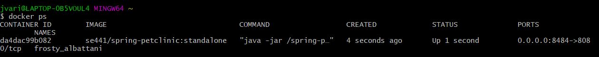

# Instructions
**Joseph Varilla ID: 1871210**

# Docker [15 pts]
- [5 pts] Your dockerfile. Please provide a link to this file rather than a screen capture.
[Dockerfile](https://github.com/jvarilla/jvarilla-spring-pet-clinic-hw8/blob/master/Dockerfile)
- [5 pts] Your running docker instance as shown by a ps command.

- [5 pts] Your browser accessing the main page of the website from your local container.
